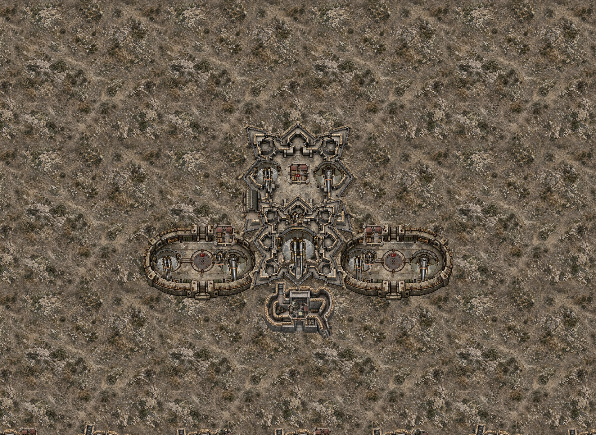
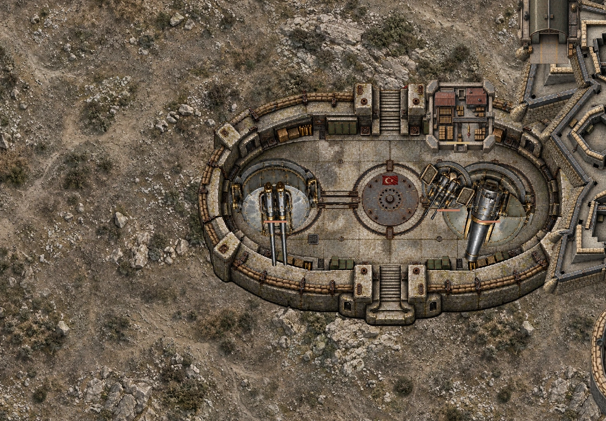
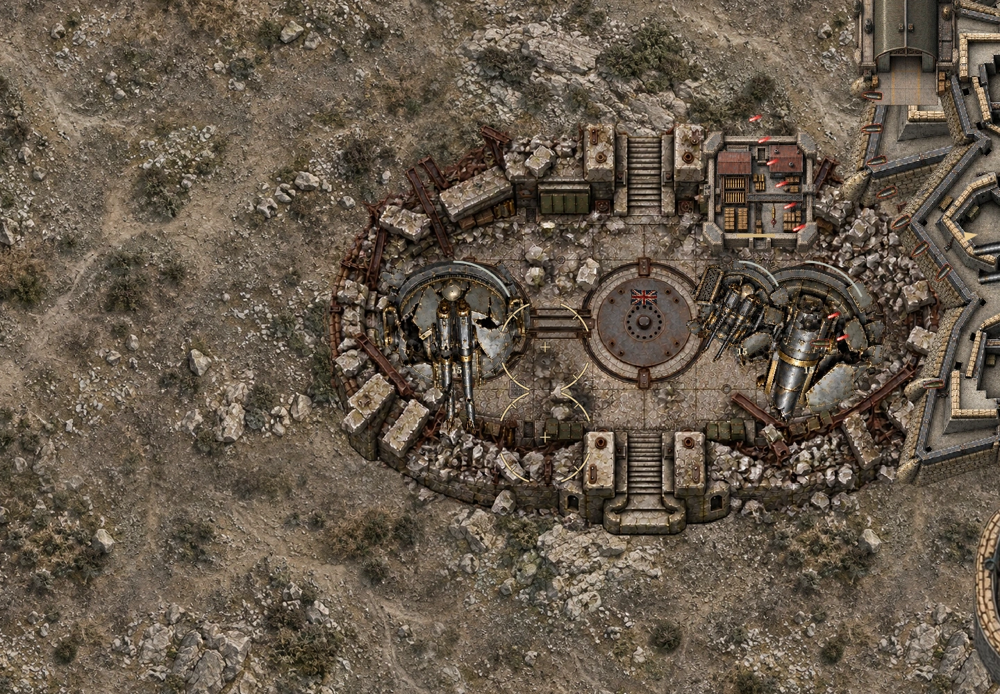
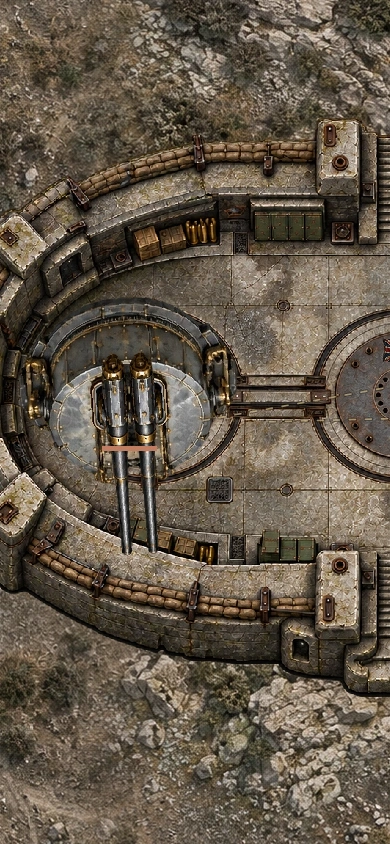
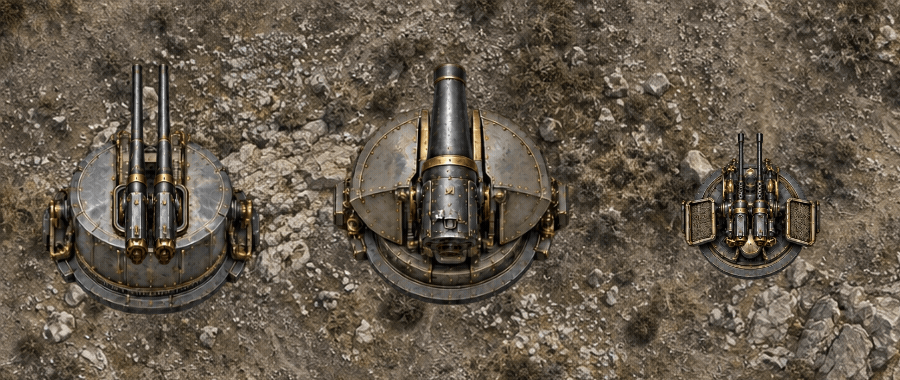

# 갈리폴리 요새 아트 r10

기준 main: `27d63b033cc7b77e2716592ca32daa5eeb1be32f`.
브랜치: `feat/gallipoli-art-rework-20261009`.

## 반영

- 성채·양익 해안포 진지 고해상도 본체와 별도 손상/붕괴 그림.
- 지휘소·탄약고·관측소·전용 격납고의 정상/손상/붕괴 그림.
- 중포·곡사포·대공포의 포가와 포신 분리, 각 정상/손상/파괴 상태.
- 회전은 포가와 포신에 함께 적용하고, 반동 이동은 포신에만 적용.
- 실제 공격 총구 거리와 쌍열 간격에 맞춘 원본 좌표 등록.
- 구역 포대 상태에 맞춘 성벽 손상/붕괴와 수리 후 복구.
- 기존 부위 좌표·HP·충돌·공격·수리 시간·진영 깃발·요격기 시스템 유지.
- 이미지 7개를 WebP/알파 투명도로 저장. 기존 에셋은 보존.

## 검증

- 최신 main 통합 후 전체 테스트 1017/1017 통과.
- 빌드 통과: 189개 모듈 문법 검사, 1648개 참조 확인, 누락 0.
- 새 등록 테스트: 세 무기, 4방향, 정상/손상, 반동 0/.12/.24에서 실제 총구 좌표 일치와 포가 고정 확인.
- 실제 렌더러로 PC 1440×1000 및 모바일 390×844, 양 진영, 손상·파괴·수리 출력 확인. 아래 이미지는 브라우저 스크린샷이 아닌 네이티브 렌더러 QA.
- 기존 라이브 갈리폴리 보스 전투 화면 확인. 수정본 Chromium 설치는 다운로드 ZIP 오류로 불가. 수정본 브라우저 실플레이·터치·실기기 FPS는 미검증.
- 별도 기존 `qa-gallipoli-engine.mjs`는 `maxHazards<80` 검사에서 실패. 진단 실행에서 8가지 조합 모두 최대 121, dropped 0을 관측했고 나머지 수리·출격 중단·처치 검사는 통과. 원본 검사나 전투 로직을 이 작업에서 완화/변경하지 않았다. 전체 테스트 및 빌드 성공과 이 별도 QA 실패를 구분한다.
- main 병합/배포하지 않음.

## 검토

재현: `HEADON_QA_CANVAS=<@napi-rs/canvas 경로> node tools/qa-gallipoli-render.mjs` 및 `tools/qa-gallipoli-recoil-r10.mjs`.

## 아트 제작 지시

내장 imagegen 사용. 공통 지시: HEAD-ON WW1 탑뷰, 절제된 석재 회색/올리브/건메탈, 정확한 기존 배치와 실루엣, 알파 투명 배경, 깃발·문자·인물 제외.
성채/양익: 기존 단독 원화의 외곽과 빈 포좌 위치를 유지하고 보강재·탄약 벽감·마모·배수로·금속 접합 디테일 재제작. 손상/붕괴는 같은 배치의 실제 잔해 그림.
시설: 지휘소/탄약고/관측소/격납고 4행 × 정상/손상/붕괴 3열.
무기: 중포/곡사포/대공포마다 포가와 포신을 별도 행, 정상/손상/파괴 3열. 반동 가능한 분리 부품, 배경 제거 후 실제 측정 좌표로 연결.
