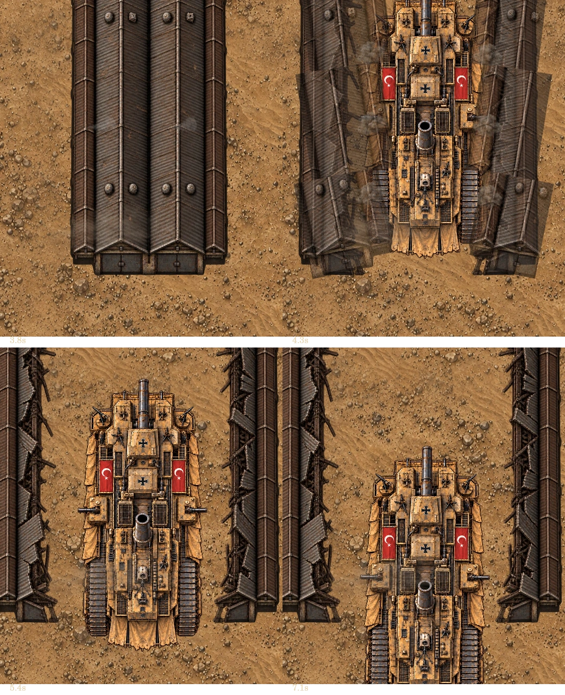
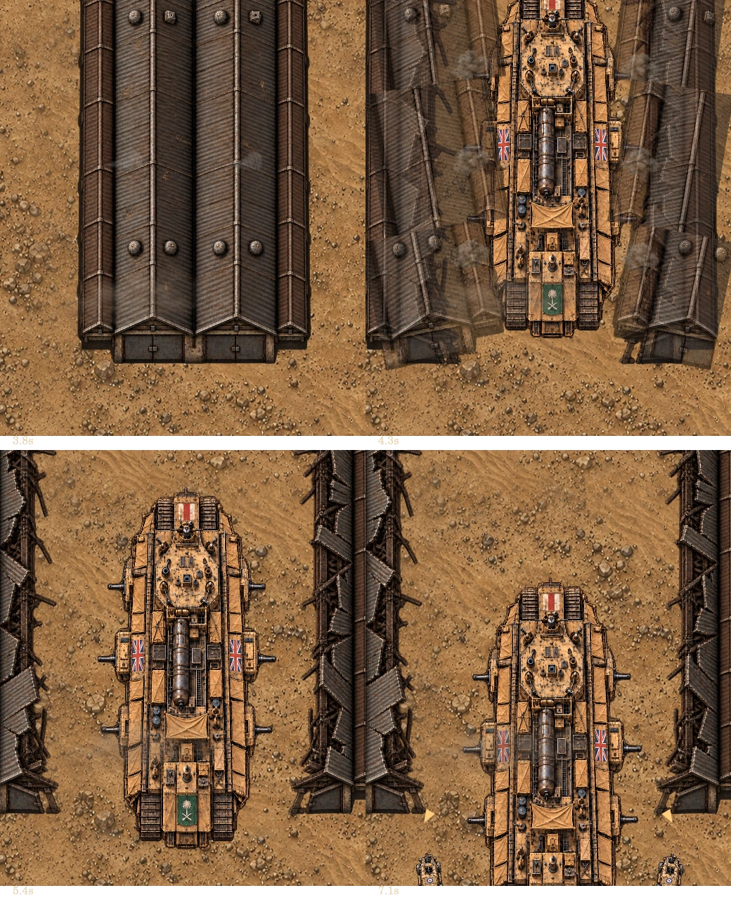
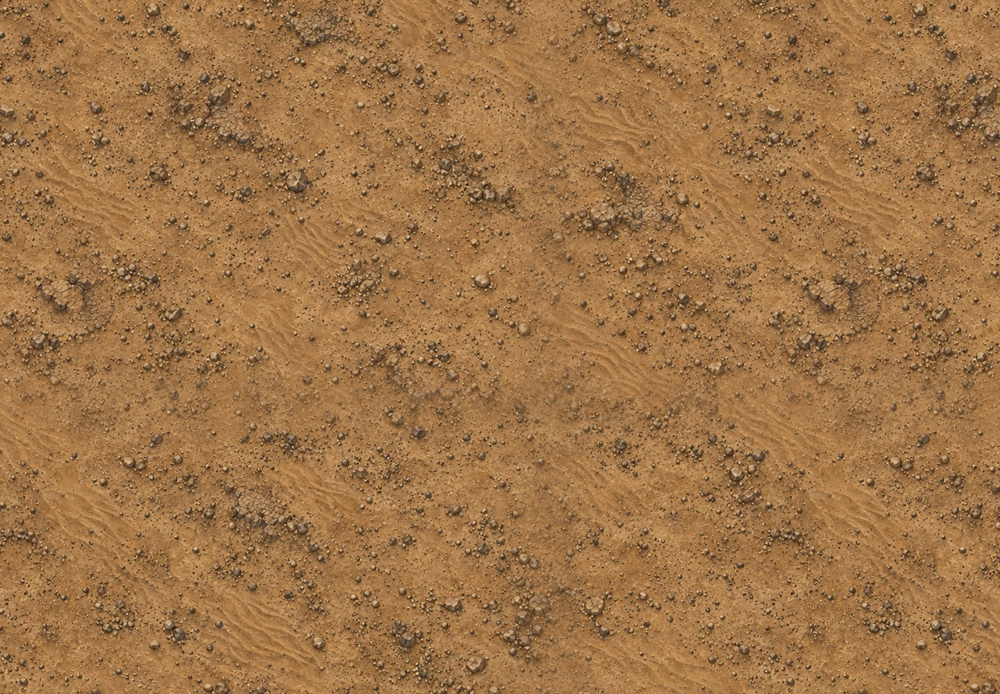

# 마안 전투 리워크 r2

작업 기준은 `leesh603/head-on-test-preview`의 최신 main `d5d1d0e209203e758fa470aa44340a4bbb6b7bfc` (v526)이다. 솜강 리워크 병합까지 포함된 원격 git HEAD에서 새 `feat/maan-desert-rework` 브랜치를 만들었다. main 직접 수정·병합·배포, source 리포 수정, 기존 커밋 재작성은 수행하지 않았다.

## 1. 양 진영 격납고 돌파

기존 Wüstenpanzer는 문 아래 18픽셀만 벌렸고 Sinai는 밝기/연기만으로 등장했다. 이제 두 보스 모두 같은 7초 경보 → 시동(2초) → 격납고 파열(4초) → 돌파(4.15~7초) 순서를 사용한다.

- 생성 때 공창의 월드 위치를 고정한다. 조종사 위치나 화면 bounds가 출현 중 건물/차체를 이동시키지 않는다.
- 파열 전 보스 이미지는 지붕 안에 숨겨진다. 새 정상/붕괴 지붕 아틀라스, 기존 roof 패널 조각과 native 흙먼지 FX로 지붕이 양옆으로 찢어진다. 파열 폭발도 공창 위치에서 발생한다.
- 부서진 지붕 양옆을 바깥으로 이동시켜 차체 통로를 확보한다. 잔해는 같은 위치에 남으며 화면 스크롤을 따라 떠다니지 않는다.
- 출현 보호 7초와 속도 상태는 유지했다. Sinai 초기 호위 2대도 그동안 숨김/무적/사격 중지이며 돌파 완료 후 차체 양옆에 전개한다.
- 보호 중 보스/호위 방향 화살표가 먼저 보이던 표시도 막았다. 마안 차체·호위의 실제 크기로 화면 내 가시성을 판정한다.
- `handleMaanCue`가 처리한 연출을 명시적으로 소비하여 공유 cue 처리로 중복 흘러가지 않게 했다.

## 2. 투명 아틀라스 정리

기존 이미지의 밝은 색 막대·외곽 잔여물·분리된 천막 조각을 제거한 정상/파괴 2열 아틀라스를 제작했다. 원래 장갑색·깃발·실루엣·리벳 디테일을 유지했다. 기존 파일은 보존했다.

| 파일 | 용도 |
| --- | --- |
| `boss-maan-wusten-r2.webp` | Wüstenpanzer 정상/파괴, 1192×1320 |
| `boss-maan-sinai-r2.webp` | Sinai 정상/파괴, 1422×1106 |
| `maan-workshop-r2.webp` | 공창 정상/중앙이 찢어진 붕괴, 1517×1037 |
| `terrain-maan-r2.webp` | 구조물 없는 사막 반복 바탕, 1254×1254 |
| `boss-maan-wusten-cut-in-r2.webp` | Wüstenpanzer 정상 열의 컷인용 프레임 추출 |
| `boss-maan-sinai-cut-in-r2.webp` | Sinai 정상 열의 컷인용 프레임 추출 |

Built-in imagegen 사용. 입력은 기존 정상/파괴 보스·공창·지형이고, 최종 생성 프롬프트 사양은 아래와 같다. WebP quality 95로 알파를 보존해 인코딩했으며 별도 코드로 배경을 지우거나 에셋을 덧칠하지 않았다.

1. Wüstenpanzer: 동일 크기의 2열 정상/파괴, 진짜 투명 배경, 정탑뷰, 기존 오스만 깃발과 철십자·주포·냉각·궤도 위치 및 암갈색 디테일 보존. 색상 막대/외곽색/분리된 조각/도색 연기 제거. 양 상태 축 정렬.
2. Sinai: 동일 크기의 2열 정상/파괴, 정탑뷰, 기존 4궤도·4측면포·영국/녹색 깃발·보일러 보존. 아래 별도 천막과 빨강/노랑/초록 잔여물 제거. 파괴된 장갑은 차체에 붙어 있고 연기는 runtime FX 사용.
3. 공창: 기존 골판 철판 지붕과 하단 문을 유지한 정상 열, 붕괴 열은 지붕 양옆 더미/휜 기둥만 있고 중앙은 진짜 투명. 같은 축/크기, 정탑뷰, 별도 연기·전차 없음.
4. 지형: 기존 색/표현 결의 정탑뷰 사막. 가는 모래결·자갈·낮은 침식 암반만, 건물/철로/참호/문구 없음, 저대비 모래로 네 경계 연결. 정사각 반복용 타일.

[alpha-check.json](qa/maan-r2/alpha-check.json): 알파 >32 기준 각 보스 아틀라스는 연결된 차체 정확히 2개, 분리된 픽셀 0. 코너 알파 0, 채도가 높은 붉은 외곽 픽셀 0. 그림에 포함된 깃발은 유지했다. 정상/파괴 열을 개별 crop하지 않고 동일 좌표 셀을 렌더하므로 부위 교체가 차체를 흔들지 않는다.

## 3. 사막 보스 패턴

- **모래바람 엄폐:** map에서 이동하는 먼지 셀 안에서는 마안 보스가 플레이어의 새 좌표를 포착하지 않는다. Wüstenpanzer는 마지막 관측 지점을 포격하고 즉시 조준 기관총/측면포를 멈춘다. Sinai의 지휘부가 살아 있을 때도 같은 엄폐 규칙을 따른다. 호위 사격도 엄폐 안에서 중단된다.
- **Wüstenpanzer 모래 충격파:** 중포 낙탄과 함께 1.8초 예고 후 속도 95로 반경 38→140의 얇은 고리가 퍼진다. 고리 두께 22만 위험하며 지난 고리의 안쪽은 비어 있다. 중포 파괴로 중포와 충격파 모두 중단. 냉각장치/엔진/궤도의 기존 과열·증기·폭주·감속 효과 유지.
- **Sinai 사막 차단 포격:** 표적을 한 번 확정하고 좌우에서 순차 포격하되 중앙 110 월드 단위 통로를 보장한다. PC 최대 4발, 폭 <500 최대 3발. 경고 1.6초 이상. 통로는 마지막 폭발 종료까지 표시되며 플레이어 반경 12를 포함해 포격과 겹치지 않는다. 해당 포격 중 기관총과 호위 사격을 잠시 멈춘다.
- **Sinai 지휘부 파괴:** 현재 플레이어 좌표 대신 차체 기준 고정 구역 포격으로 바뀐다. 지원구획 파괴의 호위 증원 중단, 연료 누출·부위 파괴·잔해·HP 예산과 진영 선택은 유지했다.
- 이미 존재하는 전술 힌트 영역에 한국어/영어 실제 동작 문구를 표시한다. 새 HUD/조작 흐름은 만들지 않았다.

## 4. 모래바람과 맵 연결

- 별도 `maan-weather.js`: PC 최대 3개/좁은 화면 최대 2개, 수명 24초, 진입/퇴장 페이드 3초, 월드 속도 24/−9. 한 셀에 native 먼지 스프라이트 3개만 그린다. 직접 피해·강제 이동·조작 감속은 추가하지 않았다.
- solo/coop 공통 stage host에서만 tick하고, pause/loss/region exit와 함께 멈춤/정리한다. 플레이어 조작/일반 적/핵심 공중전 로직은 변경하지 않았다.
- 먼지를 피해 경고보다 먼저 그린다. 원형 경고/충격파/표시 통로는 구별할 수 있게 유지한다.
- 기존 철로·건물 파노라마의 겹침 반복을 없애고 새 모래/암반 타일을 1:1 월드 좌표로 반복한다. 공창은 출현 위치에 한 번만 별도로 놓는다.
- `maan-ground.js`의 정규화된 경계 샘플 혼합은 이미지 준비 단계에서 한 번만 수행한다. additive 밝기 누적이나 구조물 유령상이 없다. 1104×1104 타일의 양 경계는 정확히 같은 픽셀이고, 음수/소수 카메라 좌표에서도 화면을 완전히 덮는다. 매 프레임 getImageData 작업은 없다.

## 검증과 제한

- 기준 main 전체 테스트 **301/301**. 수정본 전체 `node --test tests/*.test.mjs` **311/311**, 기존 테스트 수정 없이 추가 회귀 10개.
- `node tools/validate.mjs`: **142 모듈 문법 / 1437 참조 / 누락 0**, `git diff --check` 통과.
- 실제 Game/CoopGame 엔진 60초 × solo/coop × 양 진영 × 폭 390/1440 총 8개. native 충돌·부위 피해 20 확인, 모두 playing 유지, hazards 최대 15~18, pool dropped 0, pause 시 차체/모래바람 시간 고정. [엔진 결과](qa/maan-r2/engine-results.json).
- 실제 `drawStageBoss`의 bodies/hazards 경로와 `paintMaan`를 Skia Canvas로 렌더했다. PC 1440×1000/모바일 크기 390×844 정상·혼합 손상·출현 단계·포격 경고·경계 스크롤을 점검했다. 패턴 QA는 7초 출현 후 해당 공격 타이머만 앞당겨 경고 프레임을 재현한다. **브라우저 게임/터치 실기기 스크린샷이 아니다.**
- 8초 출현 영상도 렌더 모듈 QA다. 실기기 FPS 주장은 하지 않는다. [CPU 렌더+RGBA readback 수치](qa/maan-r2/render-metrics.json), 에셋 누락 0.
- 작업 시작 때 최신 main 라이브의 `app.js?v=477`에서 `SyntaxError: Illegal continue statement`로 게임 시작이 막혔다. 소스에서도 확인한 적 렌더 루프의 닫는 괄호 1개와 빠진 문장 구분자 1개만 브랜치에서 수정했다. 기존 공중전 기능/규칙은 바꾸지 않았다.
- **수정 브랜치의 PC·모바일 브라우저 실플레이는 미검증.** main/본섭 배포를 하지 않았으며, 푸시된 구현 커밋 `1484ae91e4b967c372737e2a51080259c2b67016`의 rawcdn.githack.com 미리보기를 열었지만 기존 aircraft.js/battlefield-art.js/portraits.js 로더의 Canvas 교차 출처 SecurityError로 게임이 시작되지 않았다. 이 미리보기를 실플레이 통과로 처리하지 않았으며 보안/CORS 설정이나 해당 공통 로더는 변경하지 않았다. [브라우저 기록](qa/maan-r2/browser-check.json).

## 재현

```sh
node --test tests/*.test.mjs
node tools/validate.mjs
node tools/qa-maan-engine.mjs
# 외부 설치한 @napi-rs/canvas 경로. 게임 배포 의존성은 추가하지 않음.
HEADON_QA_CANVAS=/path/to/@napi-rs/canvas node tools/qa-maan-render.mjs
```





[Wüstenpanzer 출현 영상 — 렌더 QA](qa/maan-r2/arrival-wusten.mp4) · [Sinai 출현 영상 — 렌더 QA](qa/maan-r2/arrival-sinai.mp4)

## 수정 파일

- 게임: `app.js`, `boss-feedback.js`, `headon-stageboss-patterns.js`, `maan-boss.js`, `maan-layout.js`, `maan-view.js`, `stageboss-host.js`, `stageboss-view.js`, `maan-ground.js`(신규), `maan-weather.js`(신규).
- 아트: 위 표 6개 신규 파일.
- 테스트: `tests/maan-rework.test.mjs` 신규.
- 재현: `tools/qa-maan-engine.mjs`, `tools/qa-maan-render.mjs` 신규.
- 이 보고서와 `qa/maan-r2/` 렌더·영상·엔진·알파·브라우저 기록.
