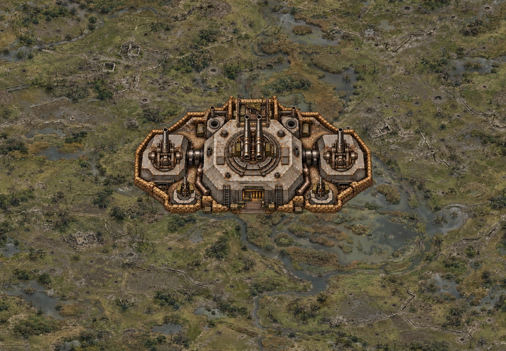
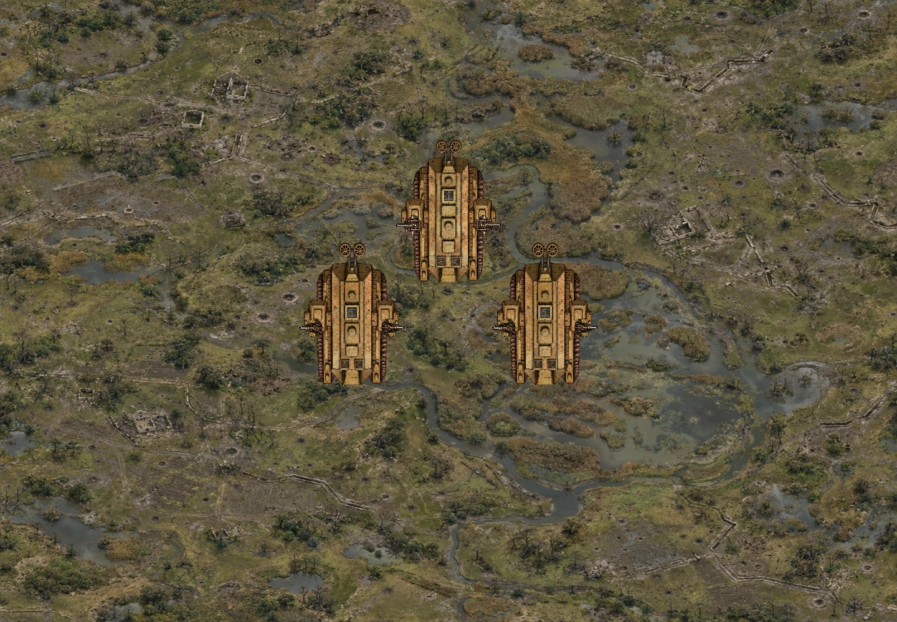
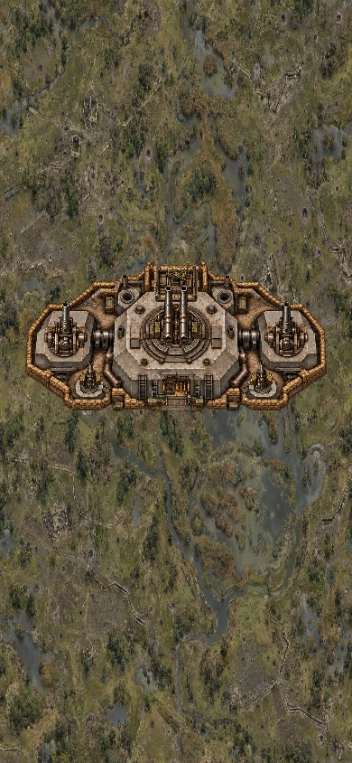
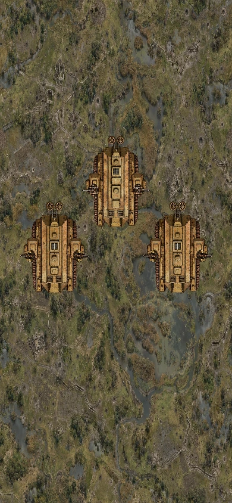

# 솜강전선 보스 리워크 r2

## 기준과 브랜치

- 저장소: `leesh603/head-on-test-preview`.
- 최신 main 시작 기준: `a6edb574ad2b37606a32c43dc63356275a012470` / v519. GitHub 커넥터의 이전 main 응답 대신 실제 git 원격 최신 체크아웃과 커밋 객체로 확인했다.
- 브랜치: `feat/somme-landship-fortress-rework`.
- 베르됭 리워크가 반영된 최신 상태를 그대로 보존했다. source 리포, main, 본섭은 수정하지 않았다. 배포·병합·기존 커밋 재작성은 수행하지 않았다.

## 마크 I 최초 랜드십 돌파대

- 기존 이동은 차체가 천천히 회전하는 동안 목표 방향으로 바로 평행이동하고, 화면 bounds로 월드 위치를 clamp했다. 파트너 간 간격 보정도 차체를 옆으로 밀었다.
- 이제 월드 좌표에서 차체의 진행축으로만 이동한다. 가속 13, 제동 34, 최고 속도 17 월드 단위/초(화면 배율 적용). 화면 이동이 전차를 이동시키지 않는다.
- 짧은 돌파 전진 → 제동 → 1.15초 재정렬 → 같은 축으로 후진한다. 다른 전차·잔해를 이동 전에 검사해 정지하며, 강제로 옆으로 밀지 않는다.
- 한쪽 궤도 파괴 시 최고 속도 5.5와 비대칭 선회. 양쪽 파괴 시 위치·방향 고정. 궤도 흔적은 실제 이동 거리 기준, 최대 18개·6초. 기존 dirtMix/smokeDust FX를 사용한다.
- 수컷 전차는 정지한 뒤 예고된 3발 포격을 발사한다. 암컷 전차 2대는 정지 사격 중 기관총 엄호 간격을 단축한다. 각 차체의 HP·잔해·부위 파괴·전체 HP 예산은 유지했다.
- 측면 장갑 하우징은 차체에 고정. 별도 포신만 회전한다. 포신은 측면 중심에서 ±1.45rad 범위로 제한하고 반대편 대상에는 사격하지 않는다.
- 새 본체는 진짜 투명 알파를 사용해 이전 갈색 사각 배경을 제거했다. 손상/잔해 프레임의 차체 중심과 측면 소켓을 각각 등록했다.

## 슈파벤 보루

- 고정 본체/지원시설 → 회전 포신 순으로 렌더한다. 관측소·탄약고가 나중에 그려져 포신을 가리는 문제를 제거했다. 중포 포좌나 나무 구조물이 통째로 회전하지 않는다.
- 낮은 콘크리트 구조물·빈 무장 소켓·참호·지하 출입구를 갖춘 본체 4상태와 독립 포신 3상태를 새로 그렸다. 실제 총구와 발사 원점이 같은 소켓/포신 길이를 공유한다.
- 일반 차단 포격과 전진 포격을 교대한다. 포격은 최대 5발(탄약고 파괴 시 최대 2발), 경고 1.65초 이상, 표시된 빈 통로 보장. 전진 포격의 경고 통로도 전체 행 범위를 표시한다.
- 쌍열 AA는 포착 지점 양옆을 순차 포격한다. 살아 있는 중포 경고 통로와 겹치는 AA는 발사하지 않는다. 관측소 파괴 후에는 중포와 AA 모두 조종사 좌표 추적을 중단한다.
- 관측소 파괴의 조준 취소, 탄약고 유폭 1회/재장전 지연, 중포 2문 또는 지원시설 2곳 파괴의 코어 개방은 유지했다.
- 기존 UI 위치를 유지하며 전술 안내 문구만 실제 새 동작에 맞게 한국어/영어로 갱신했다.

## 새 에셋

Built-in imagegen으로 기존 에셋을 참조해 제작했으며 CLI 생성은 사용하지 않았다. 생성 후 알파를 보존해 WebP quality 94로 인코딩했다. 기존 이미지 파일은 삭제하지 않았다.

| 파일 | 제작 프롬프트의 핵심 사양 |
| --- | --- |
| `boss-schwaben-body-r2.webp` | 기존 톤의 탑뷰 보루, 2×2 정상/손상/코어 개방/붕괴, 낮은 후방 관측 지붕, 빈 포대 소켓, 모래주머니·토사 가장자리 |
| `boss-schwaben-guns-r2.webp` | 포좌 없이 회전 포신·수신부만, 쌍열 AA/중포/MG 각 정상·손상·잔해, 투명 배경, 위쪽 포구 |
| `boss-mark1-hulls-r2.webp` | 역사적 마크 I, 전방 위·후방 조향 바퀴 아래, 수컷/암컷 각 정상·손상·잔해, 별도 궤도·스폰슨 제외, 투명 알파 |
| `boss-mark1-hardware-r2.webp` | 좌우 궤도와 수컷/암컷 고정 측면 하우징 4열×3상태, 정상 하우징은 포신 없이 소켓만 |

## 검증

- 시작 기준 전체 테스트: 262/262 통과.
- 수정본 전체 `node --test tests/*.test.mjs`: **269/269 통과**, 추가 회귀 7개. 측면 사격 취소 테스트의 타깃만 새 물리 회전 범위 안으로 이동했다. 나머지 기존 검증을 유지했다.
- `node tools/validate.mjs`: 루트 모듈 133개 문법, 참조 318개 검사 통과, 누락 0.
- `git diff --check` 통과.
- 실제 Game/CoopGame 엔진 60초씩 × 솔로/협동 × 양 진영 × 폭 390/1440, 총 8개 시나리오 통과. native host 충돌·피해 경로 확인, 모두 playing 유지, hazards 최대 6~16, pool dropped 0, 전차 간 최소 여유 9.42 이상. [결과](qa/somme-r2/engine-results.json).
- 실제 `renderStageBossLayer` → `drawSommeBoss`를 Skia Canvas에 연결해 PC 1440×1000/모바일 390×844 출력과 12초 전차 이동을 시각 점검했다. **브라우저 게임 스크린샷/터치 실기기 결과가 아닌 렌더 모듈 QA다.** 배경은 기존 솜강 텍스처를 QA에만 사용했다.
- 120프레임 CPU 렌더+전체 RGBA readback 측정은 [render-metrics.json](qa/somme-r2/render-metrics.json). 실기기 FPS 측정이 아니다.
- 기존 v519 라이브에서 두 보스의 동작·화면을 확인했다. **수정 브랜치 PC·모바일 브라우저 실플레이는 미검증**. 공개된 커밋의 raw.githack.com 및 rawcdn.githack.com 미리보기에서 기존 aircraft.js/portraits.js/battlefield-art.js 로더에 Canvas getImageData 교차 출처 SecurityError가 발생했고, 테스트랩이 초기화되지 않았다. 미리보기 경로는 검증 통과가 아니며 main/본섭 배포는 수행하지 않았다. [관측 기록](qa/somme-r2/browser-check.json).

## 재현

```sh
node --test tests/*.test.mjs
node tools/validate.mjs
node tools/qa-somme-engine.mjs
# 외부 설치한 @napi-rs/canvas 폴더를 지정. 게임 배포 의존성은 추가하지 않음.
HEADON_QA_CANVAS=/path/to/@napi-rs/canvas node tools/qa-somme-render.mjs
```






[마크 I 렌더 모듈 이동 영상](qa/somme-r2/mark1-motion.mp4)

## 변경 파일

- 게임: `somme-landship-drive.js`(신규), `somme-boss-combat.js`, `somme-boss-layout.js`, `somme-boss-render.js`, `somme-boss-atlas.js`, `boss-feedback.js`.
- 새 이미지 4개: 위 표 참조.
- 테스트: `tests/somme-boss.test.mjs`, `tests/somme-rework.test.mjs`(신규).
- 검증 재현: `tools/qa-somme-engine.mjs`, `tools/qa-somme-render.mjs`(신규).
- 이 보고서와 `qa/somme-r2/` 렌더·영상·측정 증거.
