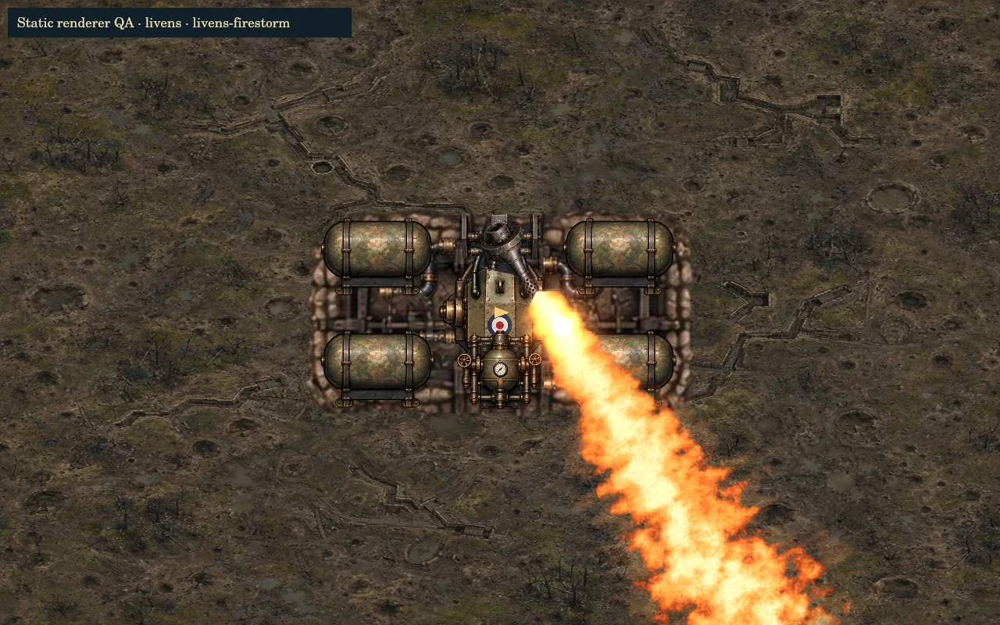
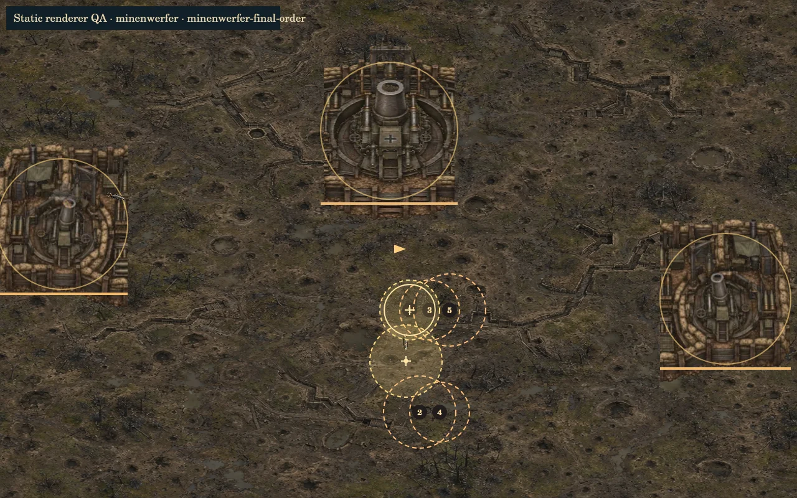
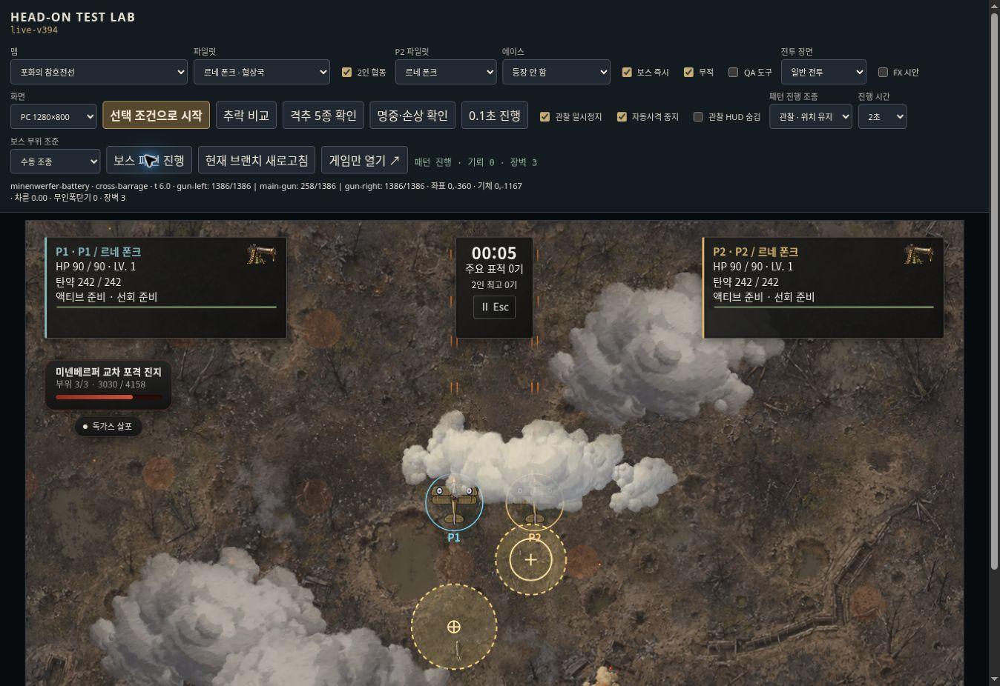

**HEAD-ON 포화의 참호전선 보스 개편 — 구현·검증 보고**

Repository: `leesh603/head-on-test-preview`
Branch: `feat/trench-fire-mortar-raid`

작업 직전 main은 `829645ea5cff915f92431aa6b7c178cd2ea96465`였습니다. 리벤스를 먼저 완성하고 20개 개별 테스트·613개 전체 테스트를 통과한 뒤 `62df514646d77e1e9853b603dbb6564eecb29768`에 commit/push했습니다. 그 다음 미넨베르퍼를 구현·검증했습니다.

작업 중 main이 진전되어 **최종 기준은 `30cd6b569a9396c18f025a2bd60924ac9f3c4da0`**으로 갱신했습니다. 그 main의 열차포 개편과 `raid1` 모듈 경로를 작업 브랜치에 보존하고 전체 검사를 다시 통과했습니다. 이 보고서의 변경 범위는 해당 최신 main과의 차이입니다. main ref 변경·main 병합·배포는 실행하지 않았습니다.

**리벤스: 화염 방향과 압력의 틈을 공략**

| 구간 | 실제 동작 | 회피·공략 |
|---|---|---|
| 등장 | 고정 시설은 이미 배치. 실제 카메라 안에 매설 노즐이 들어오고 기체가 620 이내로 접근해야 압력 상승 시작. 0.9초 후 노즐 주변 흙먼지·파편과 노즐 공개, 0.55초 후 첫 분사 준비 | 노즐 공개와 첫 화염 사이에도 예고가 존재. 카메라 밖에서는 공개 타이머가 진행되지 않음 |
| 1페이즈 | 분사 사이 플레이어를 추적하고, 공격 예고부터는 방향을 고정. 경고 후 실제 노즐에서 화염 전파 | 고정된 사선 옆으로 선회. 분사 후 2초간 본체 노출 |
| HP 70% | 좌우 교대 화염 쓸기. 반파된 탱크부터 누출 위험 원 생성 | 쓸기 방향을 읽고 회전 방향·사거리 밖으로 회피. 탱크 누출 원은 실제 탱크 위치에 고정 |
| HP 35% | 짧은 압력 분사 → 0.65초 무화염 간격 → 회전 분사 | 단속 분사와 회전을 구분해 안전 구간으로 이동 |
| HP 22% 발악기 | 압력 상승 예고 → 넓은 회전 → 반대 회전 → 긴 마지막 쓸기. 세 번의 분사는 단일 노즐에서 순서대로 발동 | 각 분사 사이 실제 화염 판정이 없는 0.65초 틈. 회전 방향에 맞춰 선회하고 방향 전환에 대응 |
| 발악기 종료 | 압력 저하, 3초간 본체 반격 기회. 발악기는 한 번만 발동 | 본체 집중 공격 |

압력장치 파괴는 진행 중인 분사를 즉시 끊고 짧은 반격 기회를 줍니다. 이후 일반·최종 분사의 실제 사거리와 지속시간, 폭이 줄어듭니다. 기존 압력 파열 폭발, 탱크 파괴 누출, HP 구간별 가스 구역, 전 부위 파괴 후 영구 본체 노출을 보존했습니다. 본체 HP와 부위 HP는 올리지 않았습니다.

기존 `livens-fire382.js`의 화염과 `livens-fire195.js`/`contains()` 판정을 그대로 사용합니다. 포구 오프셋 85, 전파하는 화염 앞·뒤, 회전 각도는 렌더와 실제 판정에 연결됩니다. 쓸기 예고는 실제 시작각부터 끝각까지 표시합니다.

**미넨베르퍼: 포격을 돌파해 고정 진지를 제압**

| 구간 | 실제 동작 | 회피·공략 |
|---|---|---|
| 접근 | 자연 조우에서 진지를 화면 앞 먼 위치에 한 번 배치. 화면 밖 실제 포구에서 순차 발사음·포연·탄도를 내고 플레이어 근처에 예고 착탄. 포연 방향 표식으로 진지 유도 | 첫 접근탄 1.4초 예고를 피하며 포연 방향으로 이동. 시설 위치는 플레이어를 따라 움직이지 않음 |
| 발견 | 화면에 충분히 들어온 포대부터 하나씩 식별. 동시에 세 문이 보이더라도 최소 0.45초 간격으로 발견. 첫 포대 발견 시 컷인·HP바 | 모바일에서는 넓게 떨어진 포대들을 직접 찾아 접근 |
| 1페이즈 | 좌 → 중앙 → 우 살아 있는 포대 순차 포격. 중앙만 중박격포 | 예고 원 밖으로 이동하며 포대 하나씩 공격 |
| HP 70% | 이동 예측 사격과 원형 포위·교차 착탄 교대. 포위에는 진행 방향의 인접 두 칸을 비움 | 열린 포위 통로 또는 교차 사선 사이로 이동. 확정된 착탄 지점은 기체를 따라 움직이지 않음 |
| 포대 1개 파괴 | 두 문 집중 방어 포격. 예약된 해당 포대 발사와 해당 태그 위험 판정 취소 | 한쪽 측면 포대만 부숴도 원형 포위가 중단됨. 중앙 파괴는 모든 후속 중박격포를 제거 |
| 포대 2개 파괴 | 마지막 포대의 빠른 순차 포격과 서로 다른 예측 간격의 전용 패턴 | 일정한 진행 방향에 머무르지 않고 예고 순서를 읽음 |
| 최후의 포격 명령 | HP 25% 이하 또는 한 문만 남았을 때 준비 예고. 세 문/두 문/한 문에서 각각 6/5/4발의 시간차 포격망. 번호가 착탄 순서 표시 | 좌우 포격망 사이로 이동한 뒤 마지막 예측탄 준비에 맞춰 선회 |
| 마지막 예측탄 | 마지막 발사 때 현재 속도로 미래 위치 예측 후 고정. 실제 화면 크기에 따라 0.9~1.35초 예고 확보. 이동하는 경고나 보이지 않는 즉시 판정 없음 | 직진을 유지하면 맞는 경로를, 예고 후 초당 2라디안으로 선회하면 피할 수 있음을 자동 검증 |
| 발악기 종료 | 3초 장전 반격 기회. 같은 잔존 포대 수에서는 반복하지 않음 | 이전 발악기 후 두 문을 더 부숴 한 문이 남으면 마지막 한 문의 전용 발악기가 별도로 가능 |

독립 HP 예산은 기존 그대로 `원래 본체 HP × 0.4`를 각 포대에 배분합니다. 본체 임의 피해는 받지 않고 포대별 실제 피격이 HP바에 합산됩니다. 파괴된 포대의 미래 발사는 예약에서 제거되며 활성/예고 위험도 해당 포대 태그로 취소됩니다. 기존 가스 구역·착탄 FX·포대 잔해를 보존했습니다.

기존 세 포대가 함께 들어 있는 `boss-minenwerfer-composite188.webp`를 각 포대별로 나누어 사용합니다. 좌/중앙/우 포대는 각각 한 번씩 그려지며 섬광·포연·탄도는 그림의 실제 관구 좌표에서 발생합니다. 추가 런타임 이미지·사운드 파일은 없습니다.

**검증 결과와 한계**

| 검증 종류 | 결과 |
|---|---|
| 리벤스 개별 자동 테스트 | 20/20 통과: 실제 시야 조건, 70%·35%·발악기, 압력/탱크 파괴, 노즐과 위험 시계 일치, 무적 없는 화염 회피, 사망·전장 전환·재시작 |
| 미넨베르퍼 개별 자동 테스트 | 28/28 통과: 접근·순차 발견, 70% 패턴, 좌우/중앙 파괴, 잔존 3/2/1문 발악기, 죽은 포대 발사 금지, 모바일/PC 예고와 선회 회피, 사망·전환·재시작 |
| 실제 Game/CoopGame 엔진 자동 테스트 | 10/10 통과: 두 진영 × 1/2인 × 390×844/1280×800에서 각각 120초 실행, 정상 아군 발사체로 부위 파괴, 정지/재개, 고정 시설 위치, 자원 상한과 dispose. 자연 조우 2개도 검증 |
| 렌더 콜백 자동 테스트 | 2/2 통과: 두 보스 등장·공격·발악기·부위 손상·잔해를 실제 production view 함수로 실행. 미넨베르퍼는 세 포대 그림과 번호 표시 확인 |
| 전체 회귀 테스트 | **714/714 통과**, 실패·skip 0. 최신 main의 열차포, 일반 전투, 협동, 지역 전환, HUD/기록 관련 기존 검사 포함 |
| syntax/import | **177개 모듈 syntax 통과, 1,581개 import 해석, missing 0**. Test Lab 인라인 스크립트와 `git diff --check`도 통과 |
| 정적 픽셀 검증 | 실제 현재 렌더 함수와 기존 이미지로 그린 두 1280×800 프레임 확인. 라이브 플레이가 아닌 별도 canvas 렌더 |
| 실제 테스트 서버 플레이 | 기존 공개 Test Lab에서 리벤스 모바일 390×844와 미넨베르퍼 PC 2인 전투를 실행·진행. **이 서버 실행은 개편 미반영 기존 빌드 검증** |
| 변경 브랜치 실제 플레이 | 저장된 브랜치 Test Lab 로드와 한 번의 재로드에서 `Test bridge 연결 실패`. 이 실행에서는 새 페이즈를 실제 플레이로 확인하지 못함. 로컬 127.0.0.1:8081도 클라우드 브라우저 `ERR_BLOCKED_BY_CLIENT`로 차단 |

120초 자동 엔진 검사는 안정성 검증을 위해 기체 무적을 사용했습니다. 회피 가능성은 별도의 실제 위험 충돌 테스트에서 **무적 없이** 검증했습니다. 해당 회피 테스트는 보스의 화염·박격포 판정을 대상으로 하며 일반 적과 외부 가스 구역까지 포함한 실전 무피격 보장은 아닙니다. 자동 자원 검사는 위험 pool 32 미만, dropped 0, 파티클 200 미만을 확인했습니다. 휴대폰 실기기 FPS, 변경 브랜치의 모바일 터치 조작·1/2인 최종 플레이 감각, 실제 서버에서의 격파·랭킹 기록 저장은 미검증입니다. 배포 금지 범위 때문에 서버를 변경하지 않았습니다.

재현 명령:

```sh
npm run build
npm test
node --test tests/livens-trench-raid.test.mjs
node --test tests/minenwerfer-trench-raid.test.mjs
node --test tests/trench-raid-host.test.mjs tests/trench-raid-render.test.mjs
```

브랜치 Test Lab에서 포화의 참호전선, 동맹국 파일럿(리벤스)/협상국 파일럿(미넨베르퍼), 보스 즉시, QA 도구를 선택합니다. 추가된 참호 검사 부위 손상탄/파괴탄 및 HP 70%·35%·발악기 진입탄은 실제 아군 발사체 경로를 사용합니다. 리벤스 본체 목표는 노출된 반격 창을 기다립니다. `보스 패턴 진행`으로 실행하며 보스 HP·phase를 직접 대입하지 않습니다.

**수정 파일·재사용 에셋**

| 파일 | 변경 |
|---|---|
| `headon-stageboss-patterns.js` | 리벤스·미넨베르퍼 두 클래스만 등장·패턴·부위 연계·정리 확장 |
| `stageboss-view.js` | 두 보스의 노즐 공개, 정확한 쓸기 예고, 포대별 atlas 그림·관구 FX·번호·진지 방향 표시 |
| `headon-stageboss-render.js` | 노즐 공개 상태와 포대 발견 상태를 view로 전달 |
| `headon-stageboss-runtime.js`, `headon-stageboss-hud.js`, `app.js` | 이 두 보스만 발견까지 초기 컷인/HP바 대기 |
| `stageboss-host.js`, `boss-feedback.js` | 이 두 보스의 조우 거리·압력/포격 준비음·전술 안내 |
| `test-lab.html` | 참호 전용 실제 발사체 검사 도구. 최신 main의 기존 열차포 QA도 보존 |
| `tests/livens-trench-raid.test.mjs`, `tests/minenwerfer-trench-raid.test.mjs` | 보스 개별 검증 |
| `tests/trench-raid-host.test.mjs`, `tests/trench-raid-render.test.mjs` | 실제 엔진/협동 및 production view 검증 |
| `TRENCH_RAID_REPORT.md`, `qa/trench-raid/*` | 보고서와 검증 이미지. 게임 런타임에 연결되지 않음 |

재사용: 기존 리벤스 base/parts/nozzle/mount/pipe 이미지, 기존 미넨베르퍼 composite, mortar impact atlas, 기존 흙먼지·파편·화염·포연 FX와 `flameValve`, `flameBurn`, `mortarLaunch`, `approachWarning`, `earthImpact` 사운드. 새 범용 보스 시스템과 관련 없는 리팩터링은 없습니다.

정적 렌더 자료(실제 플레이 화면 아님):




기존 공개 서버의 PC 협동 플레이 증거(개편 미반영):


