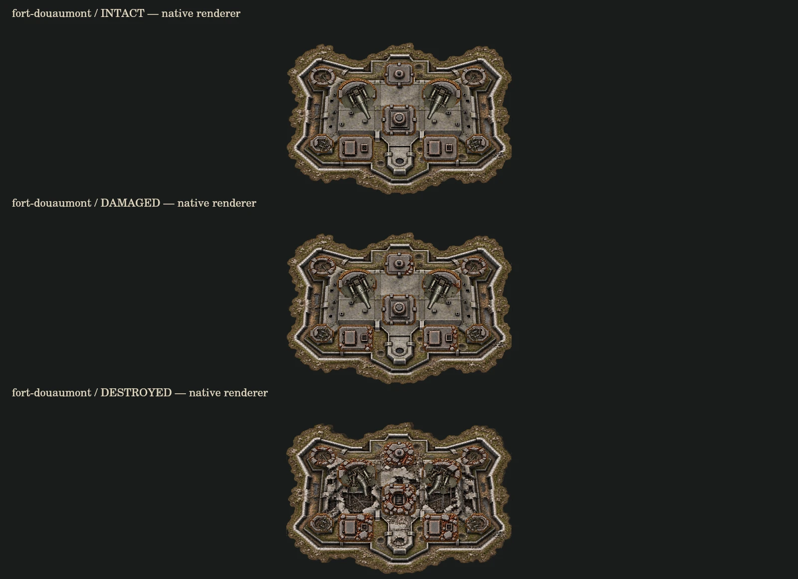
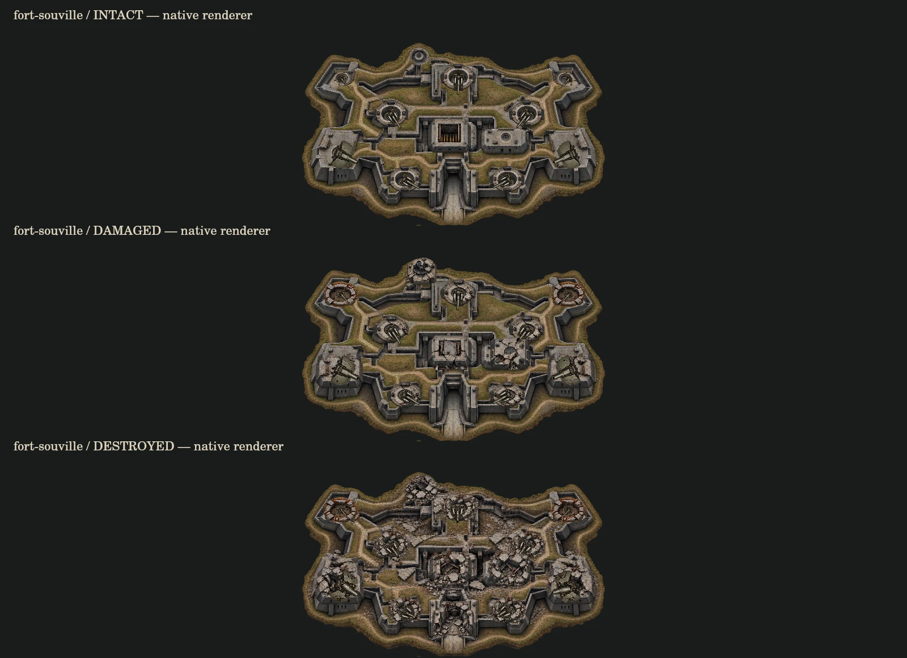
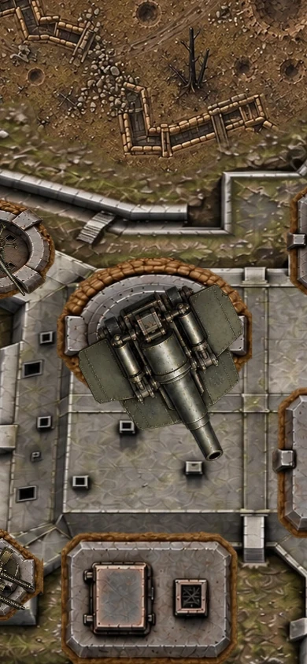
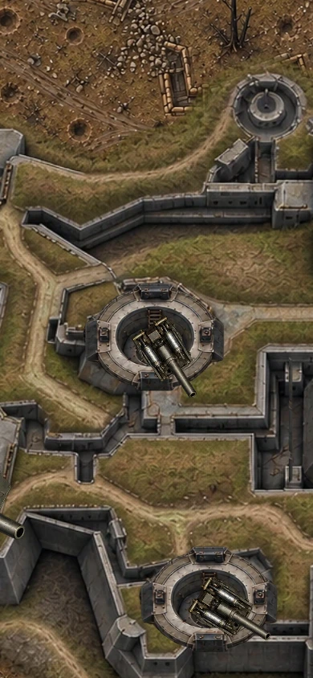

# 베르됭 두오몽·수빌 아트 r9

기준: `leesh603/head-on-test-preview` main `ac098e20036e0ac21d90f1dcf1ac6e72a244525c`.
브랜치: `feat/verdun-art-rework-20261009`.

## 반영 내용

- 두오몽·수빌 본체/붕괴 아틀라스와 건축 부위 아틀라스를 r9로 교체. 기존 요새 실루엣과 부위 배치는 보존했다. 앞서 만든 자유 구성 시안은 기존 충돌 위치와 달라 연결하지 않았다.
- 중포·쌍열 기관총·대공포·수빌 벙커포·수빌 승강포를 별도 신규 무기 아틀라스로 제작했다. 각 3상태(정상/손상/파괴), 총 15프레임. 기존 건축물과 붙어 있는 작은 무기 그림 대신 이 독립 아틀라스를 사용한다.
- 무기별 원본 사각형, 회전축, 총구 끝을 등록했다. 실제 총구 거리와 기존 반동 변위를 기준으로 그리므로 공격 좌표와 그림이 함께 움직인다. 고정 진지에는 회전을 적용하지 않는다.
- 수빌 무기도 HP 55% 미만에서 손상 그림을 사용한다. 기존에는 정상/파괴 두 그림만 사용했다.
- 부분파괴, 탄약고 효과, 대공포 18초 수리, 포문 개방, HP와 충돌 크기, 공격 주기·피해량은 변경하지 않았다.
- 기존 r8 파일은 보존. 새 파일 5개는 WebP로 내보내며 실제 알파 투명도를 유지했다.

## 검증

- `npm test`: **1007/1007 통과**.
- 베르됭 전용 테스트: **38/38 통과**. 5종 무기의 정상/손상/파괴 상태, 반동 0/.12/.24에서 고정 진지 축과 실제 총구 좌표를 확인했다.
- `git diff --check`: 통과.
- `npm run build`: 루트 188개 모듈 문법 검사 통과. 전체 참조 검사는 기존 `asset-gallery.html`의 미존재 파일 4개 때문에 실패한다. 해당 경로는 기준 main의 Git tree에도 없다. 이번 범위 밖의 갤러리는 수정하지 않았다:
  - `fx-pack-v189/projectiles/tracer-amber.webp`
  - `fx-pack-v189/projectiles/tracer-cream.webp`
  - `fx-pack-v189/projectiles/tracer-orange.webp`
  - `fx-pack-v189/projectiles/tracer-violet.webp`
- 실제 `drawVerdunFort`/`paintVerdun` 렌더러로 PC 1280×800, 모바일 390×844에서 정상·개방·손상·파괴·수리 상태를 출력하고 확인했다. 아래 파일은 **렌더러 QA이며 브라우저 실플레이 스크린샷이 아니다**.
- 제공 브라우저에서 기존 라이브 수빌 전투를 확인했다. 수정본 localhost는 `ERR_CONNECTION_REFUSED`, 로컬 Chromium 설치는 다운로드 ZIP 오류로 불가했다. **수정본 PC/모바일 브라우저 플레이, 실제 터치, 실기기 FPS는 미검증**.
- main 병합 및 배포는 수행하지 않았다. 빌드의 기존 누락과 수정본 브라우저 검증이 남아 있으므로 출시 완료로 판단하지 않는다.

## 검토 이미지

재현: `CANVAS_MODULE=<@napi-rs/canvas 경로> node tools/qa-verdun-art-r9.mjs`.
