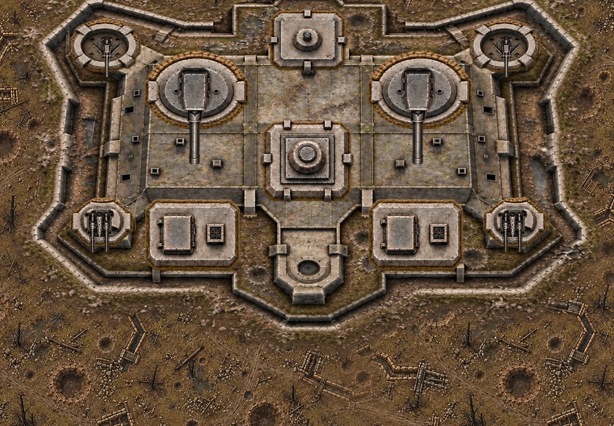
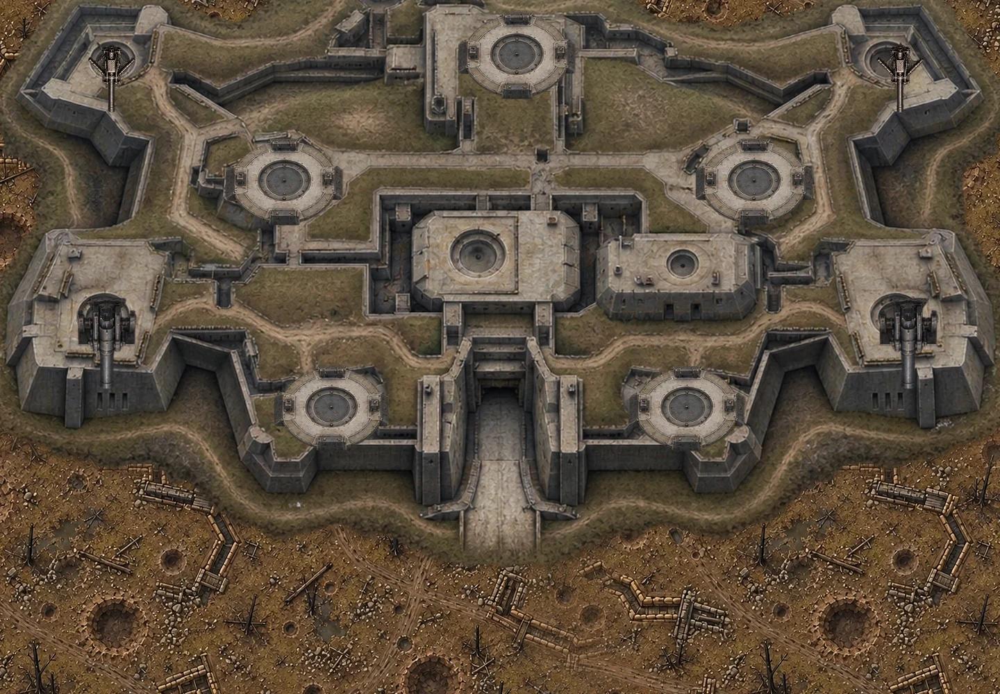
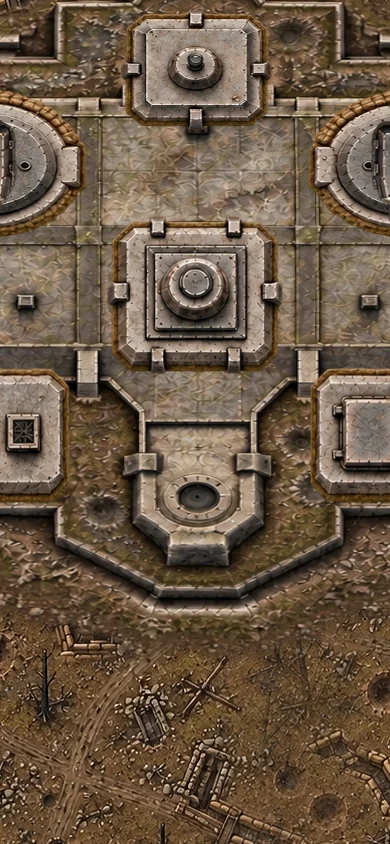
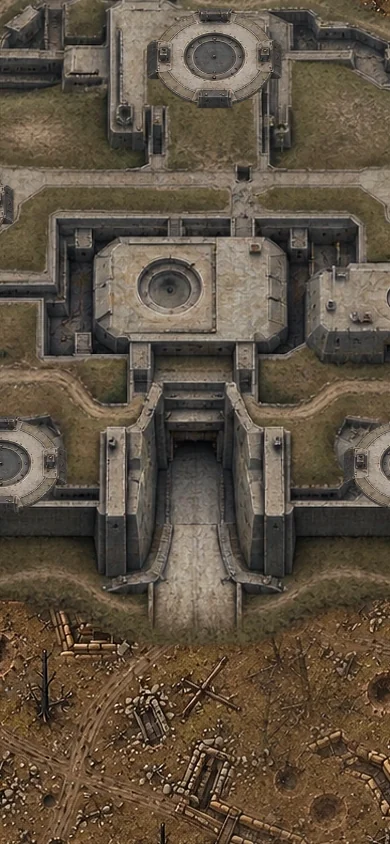
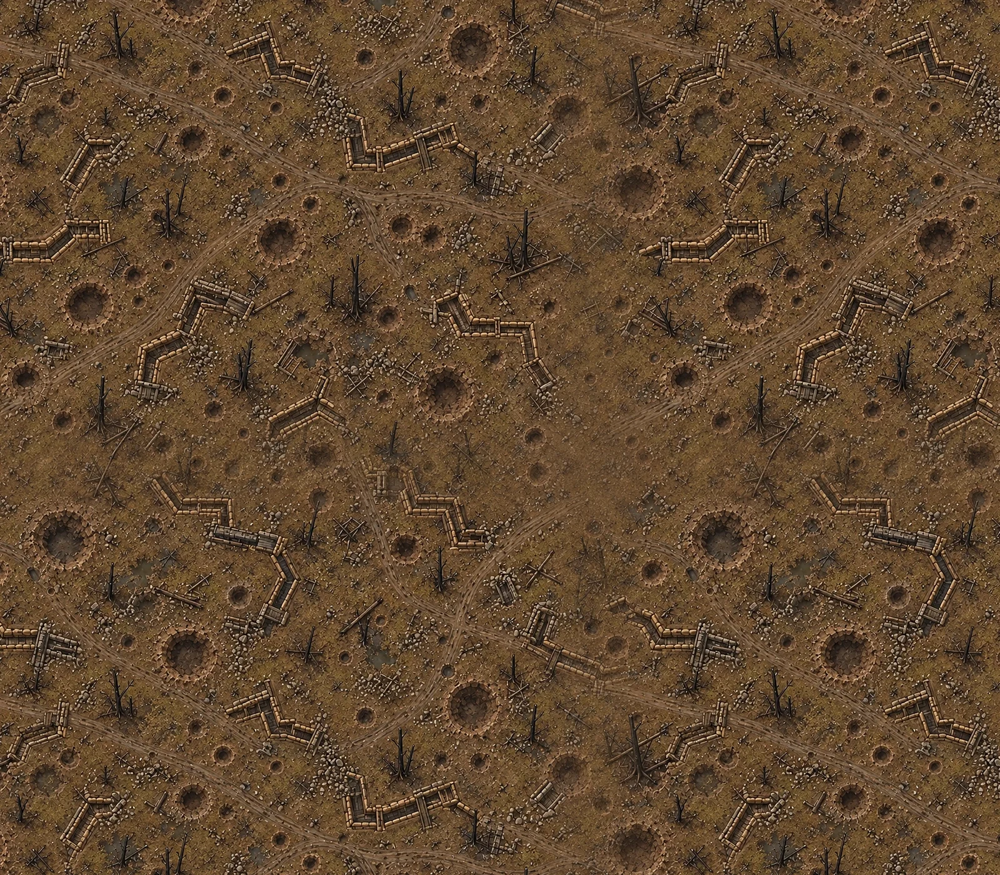

# 베르됭 지형·요새 리워크 r8

## 기준과 반영 범위

- 작업 시작 기준: `leesh603/head-on-test-preview` main `50156bd0391dc78206c0549e4fffb2366c93a51e` (라이브 v517).
- 최종 동기화 기준: main `3f4ab0abe4baebd149741048173bb3984833fca6` (v518). 작업 중 도착한 main 변경을 작업 브랜치의 부모로 반영했으며, 기존 신속 작전 XP 조정과 버전 pin을 보존했다.
- 작업 브랜치: `feat/verdun-ground-fortress-rework`.
- 뒤처진 source 리포 verdun 브랜치는 사용하지 않았다. 테스트 리포 main을 그대로 체크아웃한 뒤 새 브랜치에서 작업했다.
- main 병합, 테스트 서버 배포, 본섭 배포는 수행하지 않았다. 라이브 변경은 이 작업에서 수행하지 않았다.

## 변경

1. 지형: 보스 등장 시 기준점 변경, 화면 가장자리 clamp, 화면 크기에 따른 지형 재확대 제거. 모든 지형은 1:1 월드 좌표로 이동한다. 새 지형의 가장자리를 상보 가중치로 한 번만 합성해 경계가 이어지는 텍스처를 캐시한다. 참호를 미러링하지 않으며, 매 프레임 픽셀 합성·blur·새 캔버스 생성은 없다. 진입 준비 시 텍스처를 미리 캐시한다.
2. 접지: 본체와 지면은 같은 카메라 변환 사용. 새 요새 아틀라스에 토사 가장자리와 매립부 디테일을 보강하고, 하부 접촉 그림자를 최초 1회 캐시한다.
3. 비주얼: 두오몽·수빌의 본체/붕괴 아틀라스와 독립 파츠 시트를 imagegen으로 다시 제작했다. 사용자 추가 피드백에 따라 수빌은 기존 잔해 디자인을 폐기하고, 연결된 외곽 성벽·해자·매립 지붕·포대·중앙 출입구가 있는 통합 요새로 전면 재제작했다. 수빌 본체는 세로 2프레임, 파츠는 콘크리트 건축물 중심으로 새로 구성했다. 새 본체의 소켓 위치에 맞춰 수빌의 파츠·피격 판정·총구·핵심부 좌표를 다시 등록했다. 정상 건물은 본체에 통합하고 상태 변화만 독립 파츠로 표시해 중복 건물을 없앴다. 기존 에셋은 삭제하지 않았다.
4. 크기: 두오몽 820×590 → 1394×1003, 수빌 900×540 → 1530×918 월드 단위. 기존 화면 배율(모바일 최소 0.8)은 유지. 파츠 위치·그림 크기·피격 타원·총구·핵심부·붕괴 위치·방향 안내 범위도 같은 1.7배 기준을 사용한다.
5. AA: 두오몽 기존 외곽 AA 2기와 수빌 신규 외곽 AA 2기. 파괴 시 해당 포대의 예정 공격 취소 → 18초 뒤 수리 → 첫 공격까지 2.2초 유예. 수리 3초 전에 한국어 안내와 기존 정비 불꽃 FX를 표시한다. 해당 탄약고 파괴/핵심부 노출/보스 사망 이후에는 수리 중단. 반복 파괴는 요새 HP를 중복 차감하거나 회복시키지 않는다.

## 검증

- 기준 버전: `node --test tests/*.test.mjs` 256/256 통과.
- 수정본: 같은 전체 테스트 262/262 통과. 기존 회귀 테스트를 유지하고 좌표·대형화·AA 수리·재사격 유예·HP 중복 차감·수리 중단 검증 6개 추가.
- `node tools/validate.mjs`: 루트 ES 모듈 132개 문법 검사, import/script 316개 참조 검사 통과. 이 리포에는 package.json 또는 npm build 스크립트가 없으며 이 검사가 기존 배포 게이트다.
- `git diff --check` 통과.
- 실제 Game 엔진을 화면 폭 390/1440 × 양 진영으로 각각 60초 시뮬레이션. 외곽 AA를 native bullet→충돌 그리드→보스 피해 경로로 파괴하고 자동 수리를 확인. 네 세션 모두 playing 유지, hazard pool은 11~17개. 결과: [engine-results.json](qa/verdun-r8/engine-results.json).
- 실제 `paintVerdun`/`drawVerdunFort` 함수를 Skia Canvas에 연결해 1440×1000, 390×844 출력에서 이음새·접지·파츠 배치를 시각 점검했다. 아래 출력은 **렌더 모듈 QA이며 브라우저 게임 스크린샷이 아니다.**
- 120프레임씩 CPU 렌더+전체 RGBA readback 측정: 모바일 평균 2.25~2.36ms, p95 3.66~4.09ms. PC 평균 10.36~11.52ms, p95 14.71~16.56ms. 실제 폰 성능/FPS를 뜻하지 않는다. 지형 합성은 진입 준비 때 한 번 미리 수행하며 이 프레임 측정에서 제외된다. [측정 결과](qa/verdun-r8/render-metrics.json).
- 기존 라이브 v517 베르됭은 제공 브라우저에서 열어 확인했다. **수정 브랜치의 PC/모바일 브라우저 실플레이는 미검증**: 제공 브라우저가 localhost를 ERR_BLOCKED_BY_CLIENT로 차단하고, 실행 환경 브라우저 설치는 다운로드 ZIP 오류로 실패했다. DOM/HUD, 실제 터치 조작, 실기기 FPS와 라이브 품질 게이트는 통과했다고 주장하지 않는다.

## 렌더 모듈 QA

## 수정 파일

- `verdun-ground.js` (신규), `verdun-art.js`, `verdun-art-layout.js`, `verdun-fortresses.js`, `verdun-battle.js`, `stageboss-view.js`.
- `boss-douaumont-atlas-r8.webp`, `boss-douaumont-parts-r8.webp`, `boss-souville-atlas-r8.webp`, `boss-souville-parts-r8.webp`, `terrain-verdun-r8.webp` (신규 이미지).
- `tests/verdun-art-registration.test.mjs`, `tests/verdun-fortresses.test.mjs`, `tests/verdun-ground-repair.test.mjs` (신규).
- 이 보고서와 `qa/verdun-r8/`의 출력·측정 증거.

승인된 브랜치 결과의 검토와 추가 실플레이 검증을 위한 상태이며, main/본섭 적용 완료가 아니다.
