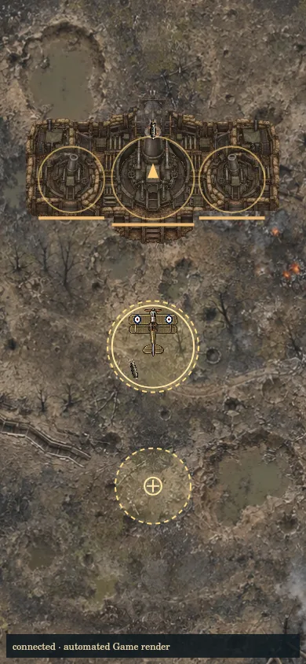
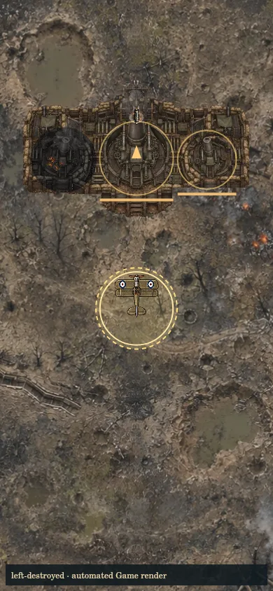
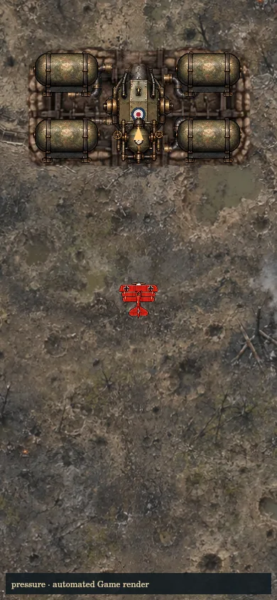
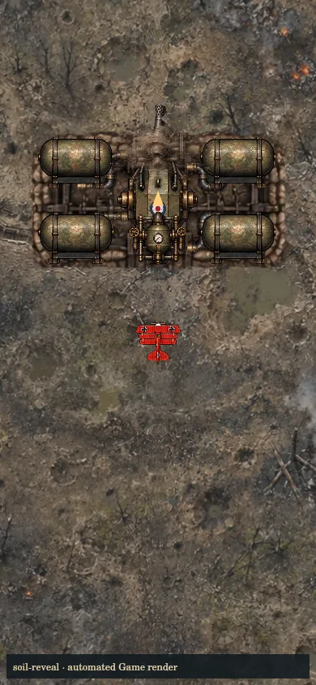
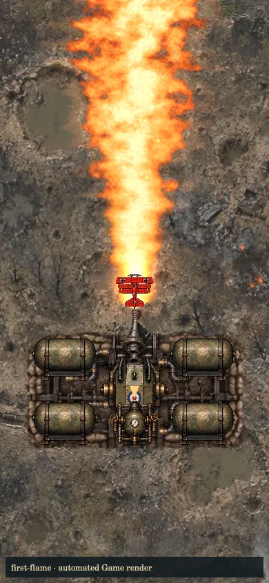
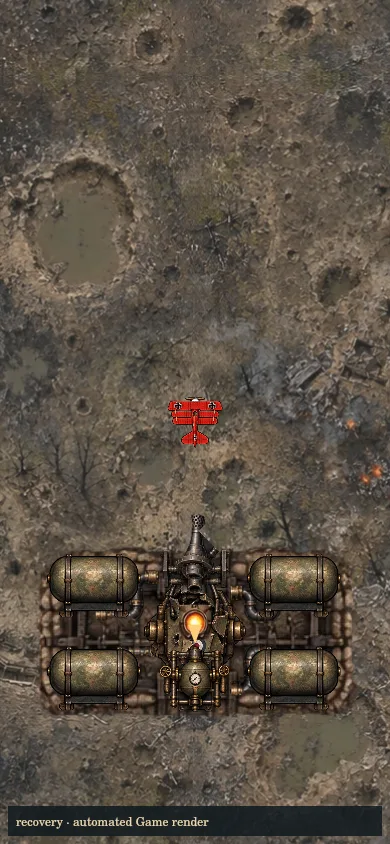

# 참호 보스 재작업 — 연결된 진지와 실제 첫 공격

Repository: `leesh603/head-on-test-preview`  
Branch: `fix/trench-boss-presentation`  
시작 main: `5b2154584fc3634832d3aa7a3fea2b80636865fa`  
검증 기준 main: `05303eda27b9b38c08b3a6d6effca6b343241668` (작업 중 들어온 열차 음향 변경 보존)  
초기 원격 체크포인트: `ccdf9a6e292c1c0ab73d465645dc8aa13c6072db`

## 잘못된 구현과 수정

미넨베르퍼의 원본 연결 진지를 세 포대 이미지로 잘라 1,065 유닛 간격으로 떨어뜨린 것이 문제였다. 하나의 원본 설치물을 한 번 렌더링하고, 그 안에 세 독립 HP·파괴 판정·발사점을 등록하도록 복원했다. 원본 이미지 바깥의 잘못된 매트와 파란 픽셀만 외곽 클리핑으로 제외한다. 포대별 손상·화재·잔해는 해당 위치에만 남는다.

리벤스는 컷인과 실제 등장 장면이 겹쳤고, 고속 진입하는 플레이어를 현재 위치로 조준해 발사 시 이미 지나친 뒤쪽에 첫 화염이 나갔다. 매설 노즐의 압력 상승·흙 분출·노출 후 1.15초 고정 예고와 실제 첫 화염을 먼저 보여준다. 첫 공격만 진입 속도를 샘플링해 1.4초 후 경로에 고정 조준한다. 이후 플레이어를 추적하는 예고가 되지 않는다. 첫 분사 0.65초 후 반격 시간에 짧은 컷인이 나온다. 압력장치 파괴로 첫 공격을 취소해도 컷인이 누락되지 않는다.

두 시설은 최초 화면 폭에 맞춰 그림·부위 판정·포구를 함께 축소하고 그 뒤 위치와 크기를 고정한다. 카메라나 플레이어 좌표를 강제 이동시키지 않는다. 원본 에셋과 전용 화염·착탄 FX를 재사용한다. 신규 게임용 에셋은 없다.

## 유지한 전투

| 보스 | 페이즈·발악기 | 부위 공략 |
|---|---|---|
| 리벤스 | 추적 조준→고정 분사, HP 70% 좌우 쓸기·누출, 35% 압력 펄스·회전, 22% 회전→역회전→마지막 쓸기·반격 | 압력장치 파괴가 현재 화염을 취소하고 사거리·지속시간을 줄인다. 탱크 파괴와 누출, 압력 저하 중 코어 노출 유지. |
| 미넨베르퍼 | 3문 순차 포격, HP 70% 예측·열린 포위·교차 포격, 2문 집중 방어, 1문 불규칙 예측, 생존 포대 수별 최후 명령 | 좌우 포대 중 하나 파괴 시 포위 포격 제거. 중앙 파괴 시 중박격포 제거. 파괴된 포대의 예약탄·위험 판정을 즉시 취소. |

HP·공격력 증가는 없다. 다른 지역의 보스 동작을 바꾸지 않는다.

## 검증 구분

- 자동 검사: `npm test` 753/753 통과, skip 0. `npm run build`: syntax 179 모듈, 상대 import 1,587개, 누락 0. `git diff --check` 통과.
- 실제 Game/CoopGame 자동 시뮬레이션: 390×844와 1280×800에서 시설 고정, 자연 조우, 첫 화염 종료까지 노즐이 화면 안에 있는지 검증. 부위에 일반 발사체를 맞히고 파괴·일시정지·120초 위험 객체/파티클 상한·정리 검증.
- 무적 없는 판정 시뮬레이션: 두 화면 폭에서 첫 화염 경로 직진은 피해 발생, 고정 예고 중 옆으로 이동하면 피해 0. 기존 발악기 회피·단일 보상·지역 전환·재시작 검사는 전체 테스트에 포함.
- 화면 검사: `tools/render-trench-presentation.mjs`가 실제 Game의 비행과 운영 렌더러·지형·원본 에셋을 실행한다. 아래 이미지는 자동 렌더링 결과이며 브라우저 실플레이 캡처가 아니다.
- 브라우저 실플레이: 원격 체크포인트의 Test Lab 로딩 및 시작을 시도했다. raw.githack 이미지 리다이렉트가 캔버스를 오염시켜 `getImageData` SecurityError로 전장 그리기가 중단됐다. 수정본 PC·모바일 실플레이, 실기기 FPS·터치 조작, 협동 화면, 실제 컷인·음향 감상은 **미검증**이다. 검사용 `qa-trench-review.html`에서만 표준 anonymous CORS를 적용하는 진입 페이지를 추가했다. 이 페이지는 HTTP 429 응답이 한 번 새로고침 후에도 계속되어 실제 실행을 검증하지 못했다. 게임 공용 이미지 로더나 다른 지역 코드는 변경하지 않았다.
- 현재 테섭 main에는 이 브랜치가 적용되지 않았다. main 병합·배포하지 않았다.

## 변경 파일

운영 코드: `app.js`, `boss-feedback.js`, `headon-stageboss-patterns.js`, `headon-stageboss-render.js`, `stageboss-view.js`.

검사: `tests/livens-trench-raid.test.mjs`, `tests/minenwerfer-trench-raid.test.mjs`, `tests/trench-raid-render.test.mjs`, `tests/trench-presentation-fix.test.mjs`.

QA: 이 문서, `qa-trench-review.html`(브라우저 실행 미검증), `tools/render-trench-presentation.mjs`, `qa/trench-presentation/*.webp`. `@napi-rs/canvas`는 선택적 QA 도구에만 필요하며 게임 의존성은 추가하지 않는다.

## 자동 렌더링 증거

PC 1280×800의 같은 장면들도 `qa/trench-presentation/`에 저장했다.
